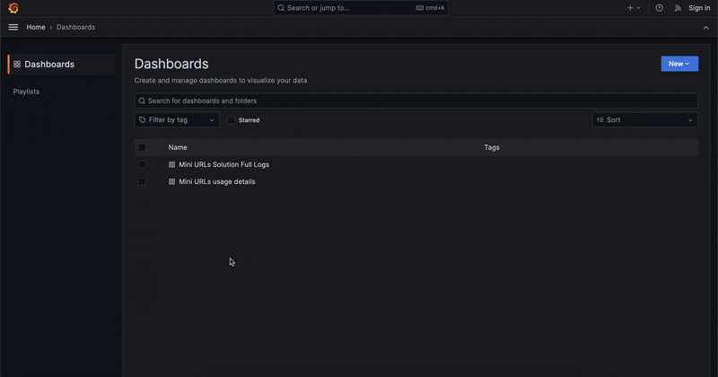

# Mini URL Builder API

- [Check the architecture decision record here!](https://diegosepusoto.github.io/mini-url-builder-api/architectural_decision_record.html)
- [Check the GitHub repo here!](https://github.com/DiegoSepuSoto/mini-url-builder-api)

## Summary
This documentation is intended to be the center stage for every 
application created for the "Mini URLs Solution" which can handle
both the creation and response of original minified URLs that are stored in
different repositories, also known as a URL Shortener.

## More info

The solution was built considering the later monitoring of its execution 
with both logs and metrics. Some basic Grafana dashboards were created
to aim for that goal:

### Mini URLs Solution Full Logs

### Mini URLs Usage Details

### Prometheus metrics (pending)