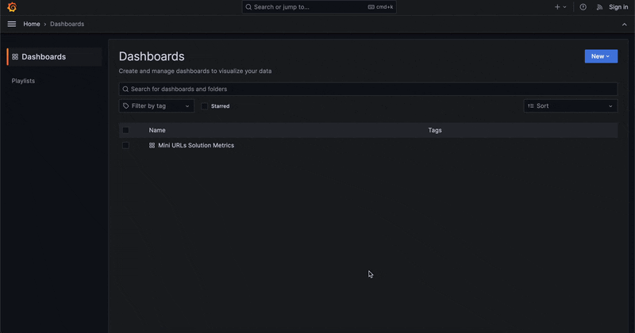

# Mini URL Builder API

- [Check the architecture decision record here](https://diegosepusoto.github.io/mini-url-builder-api/architectural_decision_record.html)

## Summary
This documentation is intended to be the center stage for every 
application created for the "Mini URLs Solution" which can handle
both the creation and response of original minified URLs that are stored in
different repositories, also known as a URL Shortener.

The created implementation involves three different applications, that
will help in the process of create, obtain and serve the minified URLs.

## Builder API description


The Builder API has one main responsibility: create a minified URL from an
original URL provided in the body of the POST request:

```json
{
  "original_url": "https://www.disney.com"
}
```

The Builder API will store the created URL in both the database (MongoDB) and
the cache layer **(Write-Through strategy)**.

Once the minified URL is created successfully, the expected JSON response is:

```json
{
    "host": "http://localhost:8081",
    "mini_url": "/00000b"
}
```

In this example, the URL http://localhost:8081/00000b will redirect the user
to the website: https://disney.com

There is a core risk in this solution: when many instances of "Builder API"
are creating minified URLs, the IDs to be chosen will collide if there's no
previous management of possible IDs to use in every Builder API instance.
That's why there's a "Distributed Sync" implementation in this solution.

## Distributed Sync description

For multiple instances of "Builder API" to run without ID collisions, this
Distributed Sync API serves as a coordinator of ranges of IDs that every
instance could use, similar to what zookeeper does in a kafka service.

If Builder API run's out of IDs, it'll make a new request to the distributed
sync API.

## Service API description


On the other hand, the Service API will handle two tasks: provide and serve
the minified URLs created, in both JSON response and HTTP redirect.

The original URL is searched first on the cache layer, if it's not present the search
is performed in the database layer **(No caching strategy used)**.

The records for minified URLs will be stored in the cache layer (Redis) following
these two policies:

- The record has a TTL of 24 hours
- The least frequently used records will be deleted on a scenario of max memory allocation
**(volatile-lfu eviction)**

For a request to get a minified URL using the endpoint:

```
/api/xyz789
```

The expected response is:

```json
{
  "minified_url": "https://www.microsoft.com"
}
```

And, for a redirect request, using the request:

```
/xyz789
```

Will return a successful redirect operation:


If the minified URL is not found, the service will perform a temporary
redirect **(HTTP Status Code 307)** instead of a permanent redirect **(HTTP 
Status Code 301)**

## List of use cases

- Create Minified URL
- Get Minified URL
- Redirect Minified URL
- Serve Minified URL in a browser
- Get application's Prometheus metrics

### Notes

In order to establish safe connections to the servers, some middlewares
were applied to both Builder API and Service API to protect a few of the
endpoints with a valid JWT token that could be created from an endpoint in
Builder API:

```
> curl --location 'localhost:8080/jwt'

> {
    "token": "eyJhbGciOiJIUzI1NiIsInR5cCI6IkpXVCJ9.e30.8x2hIBGylPBtKnAoEP8wJqqXbXaQyOK0z8bjpasZGfo"
  }
```

## More info

The solution was built considering the later monitoring of its execution 
with both logs and metrics. Some basic Grafana dashboards were created
to aim for that goal. If you are running the solution using Docker compose,
you can visit them yourself typing: **localhost:3000** in your browser

### Mini URLs Solution (Prometheus) Metrics



### Mini URLs Solution Full Logs


### Mini URLs Usage Details


