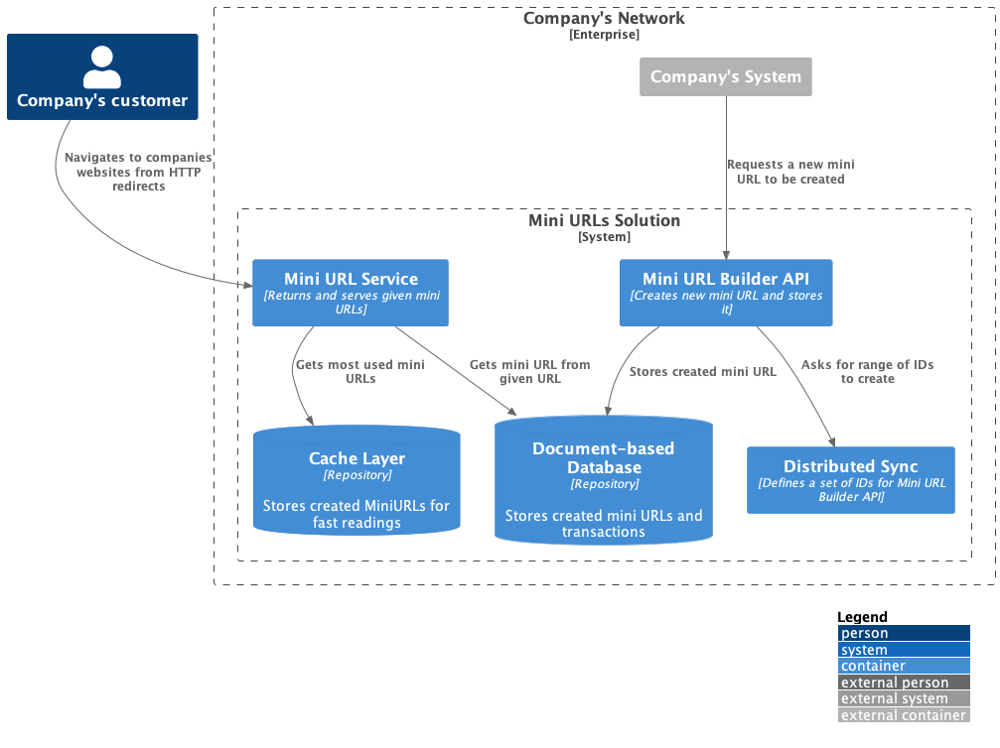

# ADR Mini URL Service
- Status: In development
- Date: 22/11/2023
- Deciders: TBD

# Context & Problem Statement

The marketing team needs a solution for the **current complexity that
many of the company's URLs are affected to**; the number of characters
in length can be overwhelming for a customer to receive, and even
could make the current (or potential) customer decide to not use the
company's services.

# Considerations

To implement the technical solution, it's important to considerate
three essential qualities of the service: It needs to be **reliable**, 
**scalable** and **performant**. This will allow the solution to be well 
received by the customers and used effectively by the marketing team.

The length of the new mini URL cannot be grater than 6 characters at the
end of a given host. For example, in a localhost environment, the new
minified URLs will have the following structure: http://localhost/abc123

To implement a future-proof solution, the minified URLs should be edited
(deleted) and have the ability to generate statistics around its use.

# Use Cases

- Given a URL, it needs to be minified to a number of characters.
- Given a minified URL, it needs to redirect the browser user to the
original URL.
- Given a minified URL, it needs to return the original URL as an API
response.

# Software considerations

There is a detail to be considered during the solution, which is how
to generate different IDs with a fixed length of 6 characters. The
solution for this requirement is to use a different number base for 
the range of 0 to **56.800.235.583**, transforming the base 10 value to 
a base 62 value. For example, the ABC123 base62 number also represents
the number 9.326.731.923 in base 10. This range of available IDs can 
generate **1.800 minified URLs per second for an entire 365-days year**.

# Decision outcome

In order to achieve the previous statements, the architecture decision
to build and test was the following:

The components are the following
- Document-based Database: Allows the solution to grow as needed
with the use of data replication across multiple instances. The data
stored have two different models:
  - Mini URLs created (key) and its original website (value)
  - Log records for the details of the creation and use of those created
  Mini URLs

- Cache Layer: Allows a quicker response that the database layer to 
send the responses with the original URLs that were minified. The data
stored in cache can be fed by a constant service that reads the most
used/served Mini URLs in the database. Or, in the other hand, another
service or platform could handle the cache layer to be fed and cleaned
with a cache strategy.

- Distributed Sync Service: Allows the Builder API to create Mini URLs with
a given set of possible IDs, so that many instances of a Builder API will
create different IDs even if an instance fails or more instances are created. 

- Mini URL Builder API: Allows the solution to create Mini URLs, store them
in the database and return it to the corresponding system.

- Mini URL Service: Allows the solution to serve and return the original
URLs stored in both the cache and database layers. Any customer can access
the mini URL on the browse, and it will be redirected. Also, any system
can use it as an API and get the original URL from a given mini URL.
